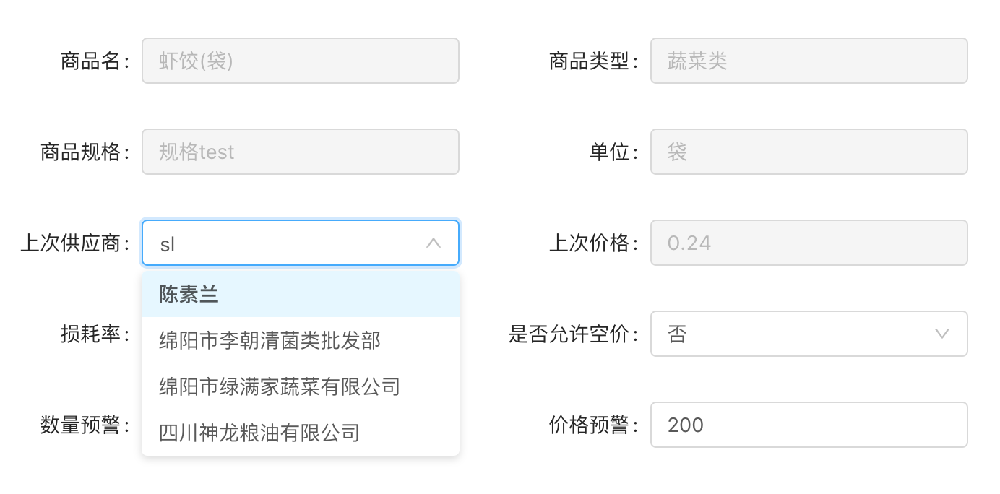

组件说明
=======
本组件主要为实现带模糊查询、本地查询功能的下拉列表框



输入参数
========
| 参数名称 | 是否必须 | 类型 | 说明 |
| ------ | ------ | ------ | ------ |
| dataSource | 必须 | array | 父组件表格中的选中项 |
| type | 必须 | string | 表示预设好的下拉列表框配置，设置了type之后就不用设置下面的两项 |
| searchType | 必须 | string | LOCALSEARCH表示从数据源中搜索，FUZZYSEARCH表示模糊查询，需要后台支持 |
| fieldConfig |可选 | array | 这是对象数组，其中包含func、param、key三个参数 |


完整的参考范例
=========
配置参数
````
<AdvancedSelect dataSource={providerData} type="PROVIDER" onChange={this.handleProviderChange}/>

handleProviderChange = (value) => {
    console.log(value);
  };
````
其中handleProviderChange必须要这个函数
