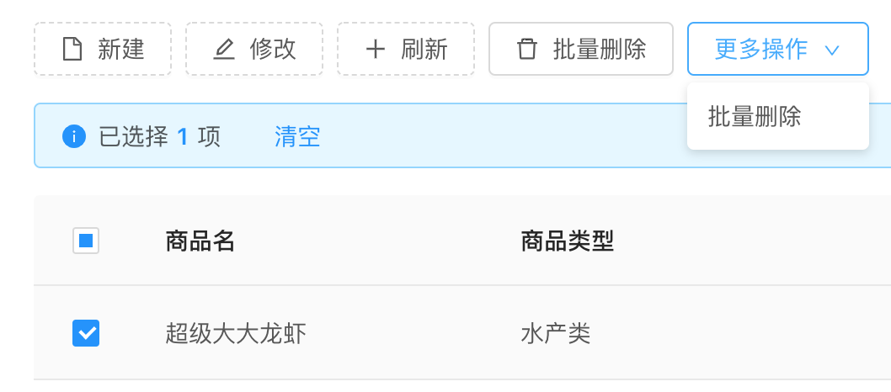

组件说明
=======
本组件结合表格，自动根据参数生成按钮组，具体的生成效果如下图所示

其中【新建】【修改】【刷新】三个按钮是primaryBtn，【批量删除】是patchBtn
【更多操作】部分是menuBtn，
>patchBtn和menuBtn 都是选中表格条目后才出现

输入参数
========
| 参数名称 | 是否必须 | 类型 | 说明 |
| ------ | ------ | ------ | ------ |
| selectedRows | 必须 | array | 父组件表格中的选中项 |
| primaryBtn | 必须 | array | 这是对象数组，其中包含func、param、key三个参数 |
| patchBtn |可选 | array | 这是对象数组，其中包含func、param、key三个参数 |
| menuBtn | 可选 | array | 这是对象数组，其中包含func、param、key三个参数 |

其中：
1. patchBtn 表示勾选列表后需要出现的按钮
2. menuBtn 表示勾选列表后需要出现的下拉菜单                           
                                     
primaryBtn 结构说明
======
此为对象数组，其结构示例为
````
primaryBtn : [{
        func : this.handleModalVisible,
        param : { s : 1, n : 2 },
        key : 'ADD',
      },
````
其中 
1. func 表示按扭要执行的父组件的函数
2. param 表示func需要的参数，可以是array 也可以是Object
3. key 表示组件中的按钮类型，可以根据组件中的预设按钮生成，预设按钮的类型请参看index.js中的BUTTON_ARRAY对象


完整的参考范例
=========
配置参数
````
const btnList = {
      primaryBtn : [{
        func : this.handleModalVisible,
        param : { s : 1, n : 2 },
        key : 'ADD',
      }, {
        func : this.handleModalVisible,
        param : [true, '其他'],
        key : 'EDIT',
      }, {
        func : this.handleRefresh,
        param : [true, '其他'],
        key : 'REFRESH',
      }],
      patchBtn : [{
        func : this.handleModalVisible,
        param : { s : 1, n : 2 },
        key : 'PATCH_DELETE',
      }],
      menuBtn : [{
        func : this.handleModalVisible,
        param : { s : 1, n : 2 },
        key : 'PATCH_DELETE',
      }],
    };
````
在render函数中调用
````
<ToolBarGroup btnOptions={btnList} selectedRows={selectedRows}/>
````
